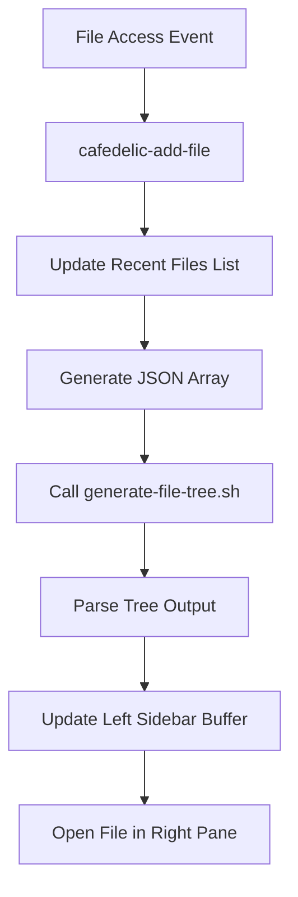

# Cafedelic File Tree Implementation Analysis

## Overview
This document analyzes the early file tree implementation found in cafedelic's git history (commits b84877d, 3205f67, 3a66f4e, 31b6139) to inform emacs configuration enhancements.

## Historical Implementation Architecture

### Core Components (May 25, 2025)

#### 1. **cafedelic-frame.el** - The Elisp Engine
**Location**: `scripts/emacs/cafedelic-frame.el`
**Purpose**: Left sidebar file tree with real-time updates

**Key Features**:
- **30-character left sidebar** for file tree display
- **Automatic project root detection** (via .git, package.json, etc.)
- **Recent files tracking** (up to 50 files with timestamps)
- **Tree structure generation** via external bash script
- **Window management** with locked sidebar width
- **Buffer cleanup** to prevent accumulation

**Core Functions**:
```elisp
(defun cafedelic-init-frame ())           ; Initialize 2-pane layout
(defun cafedelic-add-file (filepath))     ; Add file and update tree
(defun cafedelic-update-tree-display ())  ; Refresh tree via bash script
(defun cafedelic-find-project-root ())    ; Auto-detect project root
```

#### 2. **generate-file-tree.sh** - The Tree Generator
**Location**: `scripts/generate-file-tree.sh`
**Purpose**: Convert JSON file list to ASCII tree structure

**Input**: JSON array of file paths
```json
["src/index.ts", "package.json", "README.md", "src/services/watcher.ts"]
```

**Output**: ASCII tree structure
```
cafedelic/
├── README.md
├── package.json
└── src/
    ├── index.ts
    └── services/
        └── watcher.ts
```

**Key Features**:
- **JSON parsing** via jq for robust input handling
- **Directory hierarchy construction** with proper nesting
- **Sorting** (directories first, then files alphabetically)
- **Root path support** for project-relative displays
- **Unicode tree characters** (├── └── │)

#### 3. **Integration Scripts** - The Automation Layer
**Files**: `init-claude-frame.sh`, `open-claude-file.sh`, `test-stable-tree.sh`

**Workflow**:
1. Initialize frame with left tree sidebar
2. Open files via emacsclient
3. Update tree display with new file paths
4. Maintain stable 2-window layout

### Architecture Pattern: Event-Driven File Tracking



### Advanced Implementation (May 26, 2025)

#### **EmacsService** - Automated Integration
**Location**: `src/services/emacs.service.ts`
**Purpose**: Real-time file opening based on Claude's activity

**Key Features**:
- **Event-driven automation** - listens to StateManager file events
- **Batch processing** with configurable concurrency limits
- **Health checking** for emacs daemon status
- **File type filtering** (text files only)
- **Duplicate prevention** and queue management

**Integration Points**:
- **MCP Tools**: `toggle_auto_open`, `get_emacs_status`
- **Configuration**: Auto-open toggle, supported file types
- **Performance**: Batch delays, timeout management

## Technical Insights

### 1. **Two-Layer Architecture**
- **Elisp Layer**: Window management, buffer control, UI display
- **Bash Layer**: Tree generation, file processing, external tool integration

### 2. **External Script Pattern**
Instead of complex elisp tree generation, delegate to bash script:
- **Advantage**: Leverage shell tools (jq, sort, unix pipes)
- **Advantage**: Easier to test and debug independently
- **Advantage**: Can be used by other tools (not just emacs)

### 3. **Project Root Auto-Detection**
```elisp
(defun cafedelic-find-project-root (filepath)
  "Find project root by looking for markers"
  (let ((markers '(".git" "package.json" "Cargo.toml" "go.mod")))
    ; Walk up directory tree looking for markers
  ))
```

### 4. **Stable Window Management**
- **Fixed sidebar width** (30 characters)
- **Window locking** prevents accidental resizing
- **Buffer cleanup** prevents accumulation
- **Focus management** maintains user workflow

## Re-Implementation Strategy for Emacs Configuration

### Phase 1: Core Tree Display
**Goal**: Basic file tree in sidebar

**Components Needed**:
1. **Simplified cafedelic-frame.el**
   - Remove cafedelic-specific variables
   - Focus on generic file tree display
   - Integrate with perspectives.el project detection

2. **Standalone generate-file-tree.sh**
   - Copy script as-is (it's project-agnostic)
   - Ensure jq dependency is met

3. **Emacs integration hooks**
   - Hook into perspectives.el project switching
   - Track file opens automatically
   - Update tree on file access

### Phase 2: Enhanced Features
**Goal**: Rich tree interaction

**Features to Add**:
1. **Tree navigation** - click/keyboard navigation
2. **File icons** - using all-the-icons.el or similar
3. **Git status integration** - show file status in tree
4. **Folding/expansion** - collapse directory nodes

### Phase 3: Claude Code Integration
**Goal**: Sync with Claude activity

**Integration Points**:
1. **eat-mode hooks** - monitor Claude's file accesses
2. **Automatic tree updates** when Claude opens files
3. **Session-specific trees** per perspective/project

## Simplest Implementation Path

### Step 1: Extract Core Components
```bash
# Copy from cafedelic git history
git show b84877d:scripts/generate-file-tree.sh > ~/.emacs.d/scripts/generate-file-tree.sh
git show b84877d:scripts/emacs/cafedelic-frame.el > ~/.emacs.d/elisp/file-tree.el
```

### Step 2: Adapt for Generic Use
**file-tree.el modifications**:
- Remove cafedelic-specific prefixes
- Integrate with perspectives.el current project
- Hook into find-file-hook for automatic tracking
- Add configuration variables for customization

### Step 3: Integrate with Perspectives
```elisp
(add-hook 'persp-created-functions 'file-tree-init-for-project)
(add-hook 'persp-activated-functions 'file-tree-switch-to-project)
(add-hook 'find-file-hook 'file-tree-track-file)
```

## Key Learnings for Emacs Configuration

### 1. **External Scripts Are Powerful**
The bash script approach is elegant and reusable. Don't try to do everything in elisp.

### 2. **Project Root Detection Is Crucial**
The marker-based approach works well and should be preserved.

### 3. **Window Management Needs Care**
Fixed sidebar width and proper buffer cleanup prevent UI issues.

### 4. **JSON as Data Exchange Format**
Using JSON between elisp and bash scripts provides robust data transfer.

### 5. **Event-Driven Updates Work Well**
Hooking into emacs events (find-file-hook, etc.) provides automatic tree updates.

## Files to Reference in Implementation

### Essential Files from Git History
- `b84877d:scripts/emacs/cafedelic-frame.el` - Core elisp implementation
- `3205f67:scripts/generate-file-tree.sh` - Tree generation script
- `b84877d:scripts/emacs/README.md` - Usage documentation
- `31b6139:src/services/emacs.service.ts` - Advanced integration patterns

### Configuration Insights
- Fixed 30-character sidebar width works well
- Recent files limit of 50 is reasonable
- Project markers: .git, package.json, Cargo.toml, go.mod
- Supported text file extensions from FileUtils class

This implementation provides a solid foundation for enhancing emacs configuration with file tree functionality while leveraging the proven patterns from cafedelic's development.