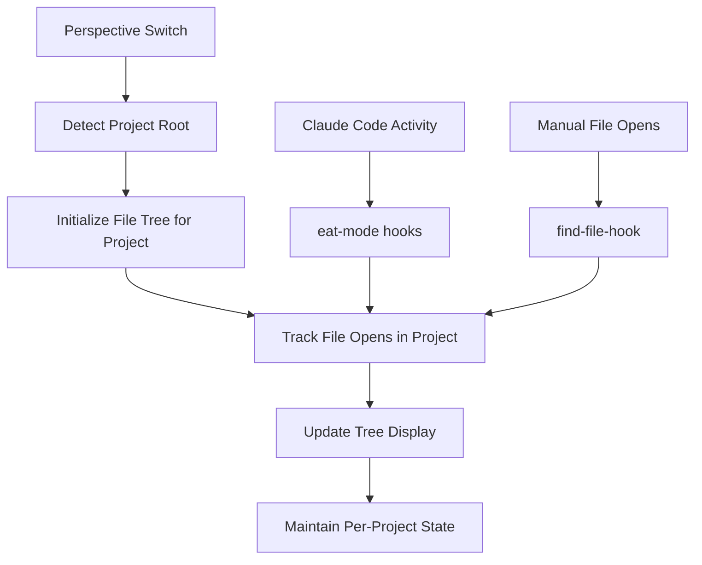

# Perspectives + File Tree Implementation Plan

## Overview
Plan for integrating cafedelic's proven file tree implementation with your emacs configuration using perspectives.el for project-based tabs.

## Architecture: Perspectives + File Tree Integration

### Current State
- ✅ **perspectives.el**: Installed, provides project-based tabs
- ✅ **claude-code/eat module**: Claude Code running within emacs
- 🎯 **Target**: Left sidebar file tree per project perspective

### Integration Strategy



## Implementation Components

### 1. **Enhanced File Tree Elisp** (`~/.emacs.d/elisp/persp-file-tree.el`)

**Core Functions**:
```elisp
;; Project-aware file tree management
(defun persp-file-tree-init-sidebar ())         ; Initialize tree for current perspective
(defun persp-file-tree-track-file (filepath))   ; Add file to current project tree
(defun persp-file-tree-switch-project ())       ; Handle perspective switches
(defun persp-file-tree-get-project-root ())     ; Use perspectives project detection
(defun persp-file-tree-update-display ())       ; Refresh tree for current project

;; Per-perspective state management
(defvar persp-file-tree-state (make-hash-table)) ; project-name -> file-list mapping
```

**Key Adaptations from Cafedelic**:
- **Per-project file tracking**: Each perspective maintains its own file list
- **Perspectives integration**: Use perspectives' project detection instead of custom
- **State persistence**: Remember file trees when switching between projects
- **Claude Code hooks**: Monitor eat-mode for Claude's file accesses

### 2. **Tree Generation Script** (`~/.emacs.d/scripts/generate-file-tree.sh`)
**Status**: ✅ Ready to use as-is (copy from commit 3205f67)

**Features**:
- JSON input → ASCII tree output
- Project root awareness
- Directory hierarchy sorting
- Unicode tree characters

### 3. **Perspectives Hooks**

```elisp
;; Hook into perspectives lifecycle
(add-hook 'persp-created-functions 'persp-file-tree-init-sidebar)
(add-hook 'persp-activated-functions 'persp-file-tree-switch-project)
(add-hook 'persp-killed-functions 'persp-file-tree-cleanup-project)

;; Hook into file operations
(add-hook 'find-file-hook 'persp-file-tree-track-file)
(add-hook 'after-save-hook 'persp-file-tree-refresh-current)

;; Hook into Claude Code activity (if detectable)
;; (add-hook 'eat-mode-hook 'persp-file-tree-setup-claude-monitoring)
```

### 4. **Project State Management**

**Data Structure**:
```elisp
;; Each project perspective maintains:
{
  "project-name": {
    "root": "/path/to/project",
    "files": ["/path/to/file1.js", "/path/to/file2.md"],
    "last-updated": "timestamp",
    "tree-buffer": buffer-object
  }
}
```

## Implementation Steps

### Phase 1: Core Integration (2-3 hours)

#### Step 1: Extract Files
```bash
# Create directories
mkdir -p ~/.emacs.d/scripts ~/.emacs.d/elisp

# Extract tree generator from cafedelic
cd /home/alex/code/cafedelic
git show 3205f67:scripts/generate-file-tree.sh > ~/.emacs.d/scripts/generate-file-tree.sh
chmod +x ~/.emacs.d/scripts/generate-file-tree.sh

# Test tree generation
echo '["init.el", "elisp/config.el", "scripts/test.sh"]' | ~/.emacs.d/scripts/generate-file-tree.sh --root ~/.emacs.d
```

#### Step 2: Create Adapted Elisp
```bash
# Get cafedelic base implementation
git show b84877d:scripts/emacs/cafedelic-frame.el > ~/.emacs.d/elisp/persp-file-tree-base.el

# Adapt for perspectives (manual editing required)
cp ~/.emacs.d/elisp/persp-file-tree-base.el ~/.emacs.d/elisp/persp-file-tree.el
```

#### Step 3: Core Adaptations
**Key Changes Needed**:
- Replace `cafedelic-project-root` with perspectives project detection
- Add per-project state management with hash table
- Modify window management to work with existing frame layout
- Integrate with perspectives hooks

### Phase 2: Perspectives Integration (2-3 hours)

#### Project Detection Integration
```elisp
(defun persp-file-tree-get-project-root ()
  "Get project root using perspectives current project"
  (when (bound-and-true-p persp-mode)
    (let ((current-persp (get-current-persp)))
      (when current-persp
        ;; Use perspectives project detection or fallback to custom
        (or (persp-parameter 'persp-project-root current-persp)
            (persp-file-tree-detect-project-root))))))
```

#### State Management
```elisp
(defun persp-file-tree-get-project-state (project-name)
  "Get or create project state"
  (or (gethash project-name persp-file-tree-state)
      (puthash project-name 
               (list :root nil :files '() :last-updated (current-time))
               persp-file-tree-state)))
```

### Phase 3: Claude Code Integration (1-2 hours)

#### Monitor eat-mode for Claude Activity
```elisp
(defun persp-file-tree-setup-claude-monitoring ()
  "Setup monitoring for Claude Code file accesses"
  (when (bound-and-true-p eat-mode)
    ;; Monitor for file open patterns in eat buffer
    ;; This may require parsing Claude's output for file paths
    (add-hook 'eat-output-filter-functions 'persp-file-tree-parse-claude-output nil t)))

(defun persp-file-tree-parse-claude-output (output)
  "Parse Claude Code output for file operations"
  ;; Look for patterns like "Reading file: /path/to/file.js"
  ;; Extract file paths and call persp-file-tree-track-file
  )
```

## Configuration Integration

### Add to your init.el
```elisp
;; Load the file tree system
(add-to-list 'load-path "~/.emacs.d/elisp")
(require 'persp-file-tree)

;; Configure tree appearance
(setq persp-file-tree-sidebar-width 35)          ; Wider than cafedelic's 30
(setq persp-file-tree-max-files 100)             ; More files than cafedelic's 50
(setq persp-file-tree-script-path "~/.emacs.d/scripts/generate-file-tree.sh")

;; Enable automatic tree updates
(persp-file-tree-mode 1)

;; Optional: Global keybindings
(global-set-key (kbd "C-c t t") 'persp-file-tree-toggle-sidebar)
(global-set-key (kbd "C-c t r") 'persp-file-tree-refresh)
(global-set-key (kbd "C-c t c") 'persp-file-tree-clear-current-project)
```

## Advanced Features (Phase 4)

### Tree Navigation
```elisp
;; Make tree clickable
(define-key persp-file-tree-mode-map [mouse-1] 'persp-file-tree-open-file-at-point)
(define-key persp-file-tree-mode-map (kbd "RET") 'persp-file-tree-open-file-at-point)
```

### Git Status Integration
```elisp
;; Show git status in tree (requires magit)
(defun persp-file-tree-add-git-status (tree-lines)
  "Add git status indicators to tree lines"
  ;; M = modified, A = added, D = deleted, etc.
  )
```

### File Type Icons
```elisp
;; Add file type icons (requires all-the-icons)
(defun persp-file-tree-add-file-icons (filename)
  "Add appropriate icon for file type"
  (when (bound-and-true-p all-the-icons-mode)
    (all-the-icons-icon-for-file filename)))
```

## Benefits Over Traditional File Trees

### 1. **Project-Aware**
Each perspective/project maintains its own file tree showing only relevant files.

### 2. **Activity-Driven**
Tree populates based on actual file access, showing what you're working on.

### 3. **Claude Integration**
Automatically tracks files that Claude Code accesses or modifies.

### 4. **Lightweight**
Uses proven external script for tree generation instead of complex elisp.

### 5. **Persistent**
File trees persist when switching between perspectives.

## Testing Strategy

### Unit Tests
```bash
# Test tree script
echo '["src/main.js", "README.md", "test/spec.js"]' | ~/.emacs.d/scripts/generate-file-tree.sh

# Test with project root
echo '["src/main.js", "README.md"]' | ~/.emacs.d/scripts/generate-file-tree.sh --root /home/alex/project
```

### Integration Tests
```elisp
;; Test in emacs
M-x persp-file-tree-init-sidebar
;; Open some files in current perspective
;; Verify tree updates automatically
;; Switch perspectives, verify separate trees
```

## Timeline Estimate

- **Phase 1** (Core): 2-3 hours
- **Phase 2** (Perspectives): 2-3 hours  
- **Phase 3** (Claude Integration): 1-2 hours
- **Phase 4** (Advanced Features): 3-5 hours
- **Total**: 8-13 hours for full implementation

## Success Criteria

✅ **Basic**: File tree sidebar shows files accessed in current perspective  
✅ **Integration**: Tree updates when switching perspectives  
✅ **Automation**: Tree updates when files are opened (manual or via Claude)  
✅ **Performance**: Tree generation completes in <100ms for typical projects  
✅ **Stability**: No interference with existing perspectives.el workflow

This plan leverages cafedelic's proven file tree implementation while adapting it specifically for your perspectives-based emacs workflow with Claude Code integration.